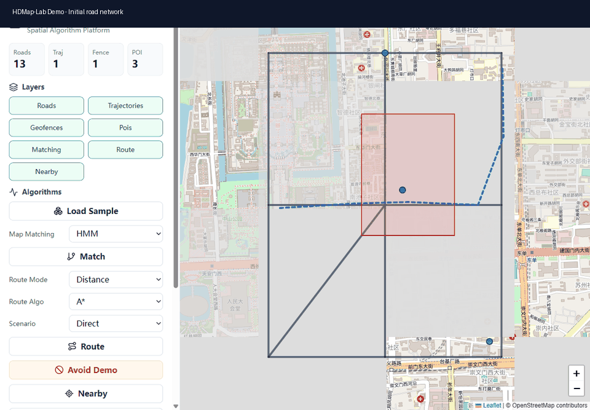

# HDMap-Lab: Computational Geometry Lab for Map Algorithms

[](https://github.com/lazyJLBL/HDMap-Lab/actions/workflows/ci.yml)


HDMap-Lab is no longer positioned as a small GIS demo. It is a map spatial algorithm laboratory focused on robust computational geometry, dirty road-network repair, spatial index engineering, HMM map matching, trajectory analysis, and explainable routing.

The project is designed to show algorithm depth: degenerate geometry cases, topology validation, before/after repair artifacts, p50/p95/p99 benchmark reports, synthetic GPS failure cases, and React + Leaflet visualizations.



## What It Demonstrates

- **Robust Geometry Kernel**: orientation, segment intersection, point-in-polygon with holes, point/polyline projection, polygon area/centroid/bbox, convex hull, RDP simplification, and first-pass corridors.
- **Topology Repair**: snap close nodes, split roads at illegal intersections, remove duplicate edges, detect dangling edges, self-intersections, overlapping roads, and connected components.
- **Spatial Index Benchmark**: brute force, grid, quadtree, KD-tree nearest lookup, basic R-tree, and STR bulk-loaded R-tree under a unified interface.
- **Map Matching Evaluation**: nearest vs HMM, heading consistency, one-way handling, turn penalty, road-class prior, synthetic noisy traces, and precision/recall reports.
- **Trajectory + Routing**: Frechet, Hausdorff, DTW, trajectory simplification, deviation detection, outlier detection, turn-cost routing, avoid polygons, road-class preferences, and path explanations.
- **HD Map Expansion**: lane-level data model, LaneBoundary, LaneConnector, StopLine, Crosswalk, TrafficLight, and OpenDRIVE stub import/export.

## Architecture

```text
GeoJSON / OSM
    -> Runtime Store + SQLite
    -> geometry_kernel / topology / spatial_index
    -> map_matching / trajectory / routing
    -> FastAPI experiment APIs
    -> React + Leaflet algorithm workbench
```

Key modules:

```text
app/
  geometry_kernel/   robust predicates, intersections, polygon and polyline algorithms
  topology/          validation, snapping, repair, graph compatibility
  spatial_index/     brute, grid, quadtree, KD-tree, R-tree, STR R-tree
  map_matching/      candidates, cost model, HMM, synthetic evaluation
  trajectory/        Frechet, Hausdorff, DTW, simplification, outlier/deviation analysis
  routing/           Dijkstra, A*, avoid polygons, turn cost, explainable routing
  hdmap/             lane-level model and OpenDRIVE stub support
```

## Quick Start

Backend:

```bash
python -m pip install -r requirements.txt
uvicorn app.main:app --reload
```

Frontend:

```bash
cd frontend
npm install
npm run dev
```

Open:

- API: <http://localhost:8000/docs>
- Frontend: <http://localhost:5173>

Docker:

```bash
docker compose up --build
```

## New Experiment APIs

All new experiment endpoints return:

```json
{
  "status": "ok",
  "data": {},
  "metrics": {},
  "warnings": [],
  "debug_layers": {}
}
```

Examples:

```text
POST /topology/validate
POST /topology/repair
POST /benchmarks/spatial-index
POST /benchmarks/map-matching
POST /trajectory/analyze
POST /routing/explain
GET  /visualization/experiments
```

Existing demo endpoints such as `/roads/nearby`, `/mapmatch`, `/route/shortest`, `/spatial/query`, and `/geofence/check` remain available for compatibility.

## Killer Demos

### Dirty Road Repair

Input:

```text
roads.geojson
```

Output:

```text
fixed_roads.geojson
topology_report.json
```

Shows illegal crossings, duplicate edges, dangling edges, connected components, and whether the repaired graph is more routable.

### HMM Map Matching Stress Test

Synthetic cases include parallel-road drift and low-frequency GPS. The benchmark compares nearest matching with HMM and reports sequence precision, recall, confidence, and latency.

### Spatial Index Workbench

Runs the same bbox query across brute force, grid, quadtree, R-tree, and STR R-tree; reports build time, candidate count, p50, p95, and p99 latency.

## Benchmarks

```bash
python -m benchmarks.spatial_index_benchmark
python -m benchmarks.map_matching_benchmark
python -m benchmarks.topology_repair_benchmark
python -m benchmarks.city_scale_benchmark --roads data/roads.geojson --queries 20
```

The API equivalent is available through `/benchmarks/spatial-index` and `/benchmarks/map-matching`.

PostGIS comparison is available when the `postgis` compose service is running:

```bash
docker compose up -d postgis
python -m benchmarks.postgis_benchmark --roads data/roads.geojson
```

## Datasets

The original demo data remains in `data/`. The upgraded experiment layout is:

```text
datasets/
  toy/
  synthetic/
  osm_samples/
```

Large OSM extracts are ignored by git. Download a local sample with:

```bash
python -m scripts.download_osm_sample --place "Tsinghua University, Beijing"
```

## Tests

```bash
python -m ruff check app tests benchmarks scripts
python -m pytest
npm --prefix frontend run build
```

Current backend coverage includes geometry degeneracies, topology repair, spatial index consistency, trajectory distances, map matching, routing, API flows, and spatial queries.

## Roadmap Status

- [x] Robust geometry kernel
- [x] Topology validation and repair v1
- [x] Spatial index multi-implementation interface
- [x] Spatial index benchmark API and CLI
- [x] HMM matching with heading/class/turn penalties
- [x] Synthetic map matching benchmark v1
- [x] Trajectory analysis module
- [x] Explainable routing with turn cost and road-class preference
- [x] React/Leaflet experiment workbench
- [x] Lane-level HD map model and OpenDRIVE stub
- [x] Algorithm whitepaper draft
- [x] City-scale OSM benchmark report generator
- [x] OpenDRIVE vector-lane and Lanelet2 XML exchange
- [x] PostGIS benchmark environment with GiST comparison script
- [ ] Full production OpenDRIVE/Lanelet2 spec coverage
- [ ] Live city-scale benchmark result committed from a large OSM extract

## Resume Bullet

Built HDMap-Lab, a computational-geometry focused map algorithm laboratory with a self-developed robust geometry kernel, road-network topology repair, multi-index spatial benchmark suite, HMM map matching evaluation, trajectory similarity analysis, explainable routing, FastAPI experiment APIs, and React + Leaflet visualizations.
