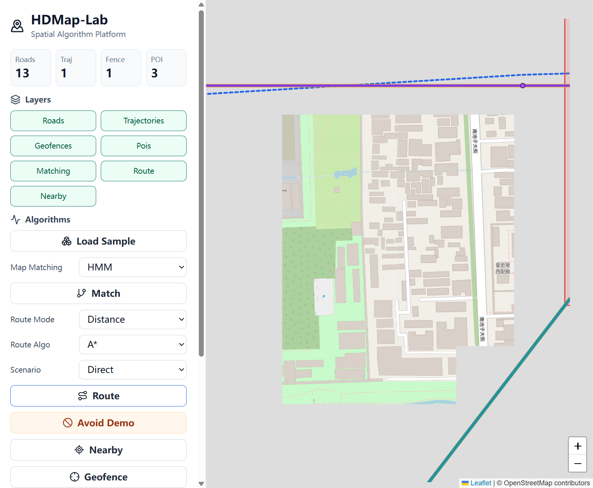
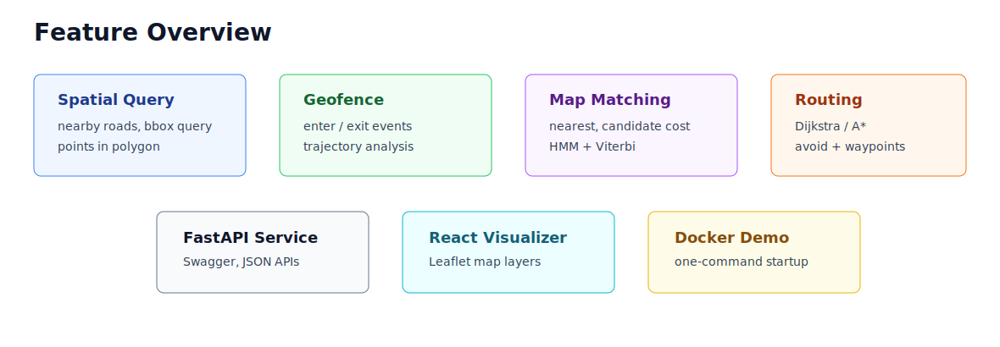
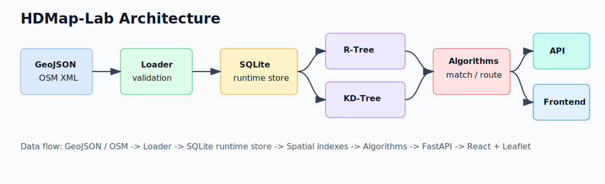
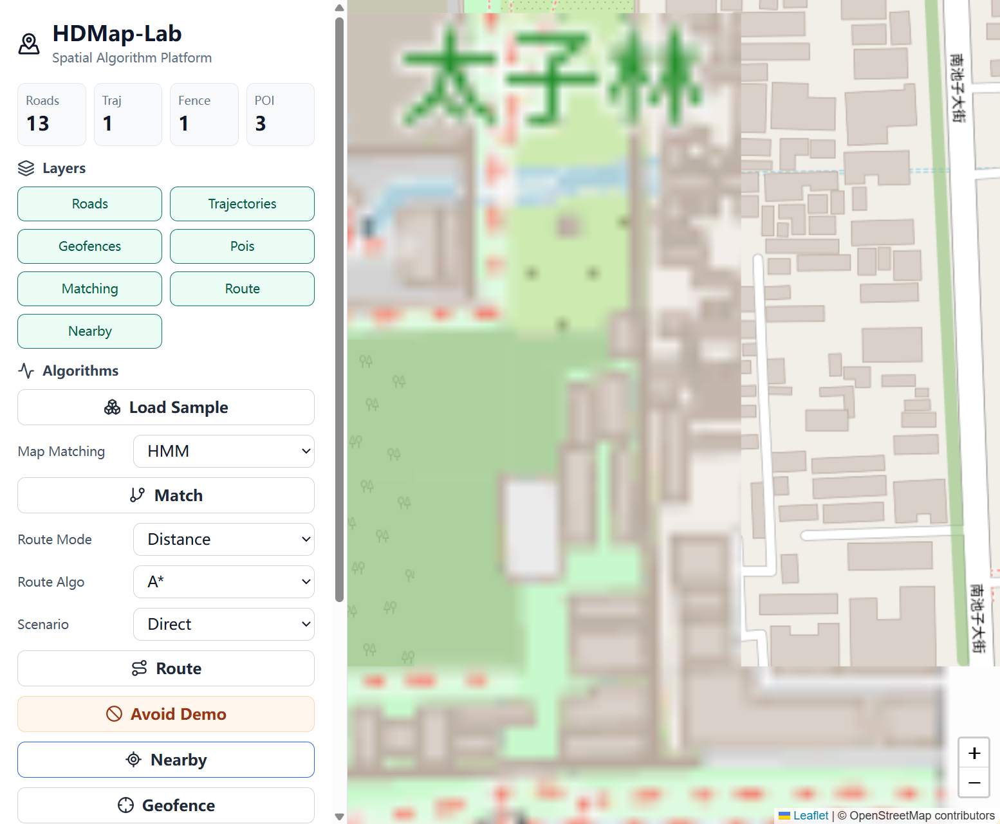
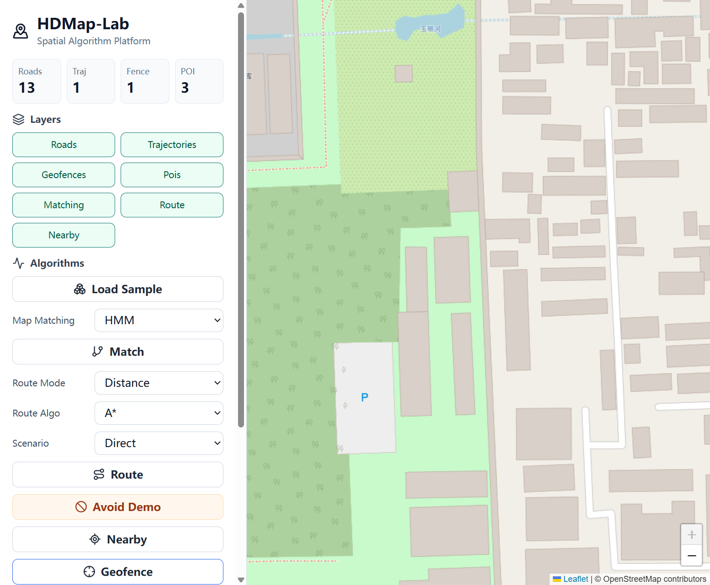
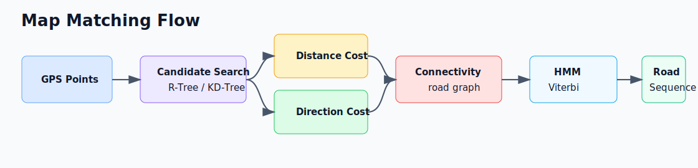
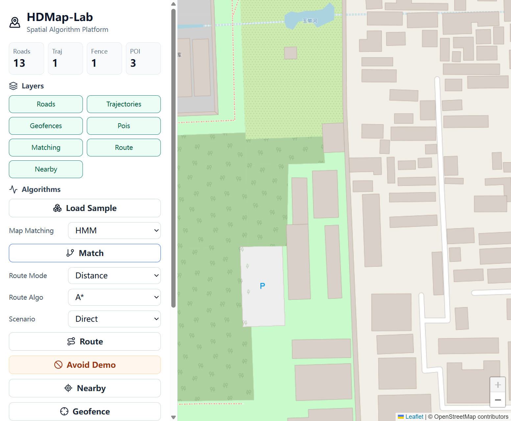
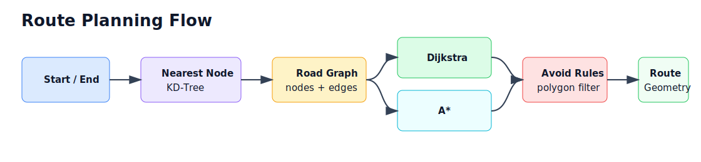
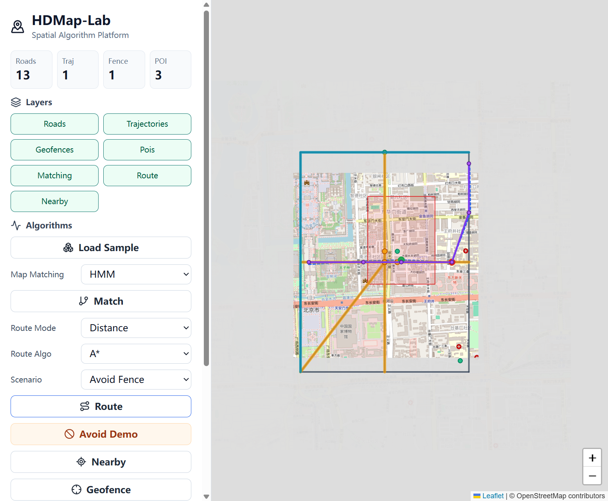

# HDMap-Lab：面向地图与轨迹数据的空间算法平台
# HDMap-Lab: Spatial Algorithm Platform for Map and Trajectory Data

[](https://github.com/lazyJLBL/HDMap-Lab/actions/workflows/ci.yml)


HDMap-Lab is a lightweight GIS / HD map spatial algorithm platform for spatial query, geofence detection, trajectory Map Matching, and route planning. It combines algorithm modules with a FastAPI service, SQLite runtime store, React + Leaflet visualizer, tests, benchmarks, and Docker deployment.

HDMap-Lab 是一个面向 GIS、高精地图、LBS、物流配送和轨迹分析场景的空间算法平台。项目支持 GeoJSON / OSM 路网加载、R-Tree / KD-Tree 空间索引、电子围栏检测、轨迹 Map Matching、Dijkstra / A* 路径规划和地图可视化。



## Why This Project

地图与轨迹业务不是普通 CRUD：它需要空间数据建模、几何计算、索引加速、路网图算法、轨迹匹配和工程化 API。HDMap-Lab 用一个小型但完整的系统，把 GIS / 高精地图岗位常见能力串成可运行、可展示、可讲清楚的项目。

## Feature Overview



- Dataset loading: built-in sample GeoJSON, custom GeoJSON, offline OSM XML, online OSM bbox/place lookup
- Spatial query: nearby roads, roads in bbox, roads in polygon, points in polygon
- Spatial index: static R-Tree for road bbox and KD-Tree for road/node nearest lookup
- Geofence: trajectory enter/exit detection with event points
- Map Matching: `nearest`, `candidate_cost`, `hmm`
- Routing: Dijkstra / A*, shortest distance, shortest time, avoid polygons, waypoints
- Platform: FastAPI, Swagger, SQLite, React + Leaflet, Docker Compose, tests, benchmarks, CI

## Architecture



```text
GeoJSON / OSM -> Loader -> Runtime Store -> Spatial Index -> Algorithms -> API -> Frontend
```

## Demo Scenarios

### Demo 1: Nearby Roads

```text
GET /roads/nearby?lon=116.4015&lat=39.9110&k=5
```

Returns the nearest road candidates, distance, projection point, heading, and geometry for map highlighting.



### Demo 2: Geofence Detection

```json
{}
```

```text
POST /geofence/check
```

The sample trajectory enters and exits the campus delivery zone. The frontend marks enter/exit points on the map.



### Demo 3: Map Matching



| Algorithm | Factors | Strength | Weakness |
| --- | --- | --- | --- |
| `nearest` | distance | simple and fast | unstable near intersections or parallel roads |
| `candidate_cost` | distance + heading + connectivity | more stable local choice | weights need tuning |
| `hmm` | emission + transition + Viterbi | global sequence optimization | more complex and slower |



### Demo 4: Route Planning



| Mode | Meaning |
| --- | --- |
| `shortest_distance` | edge weight is road length |
| `shortest_time` | edge weight is estimated travel time |
| avoid polygon | temporarily excludes roads crossing restricted polygons |
| waypoints | plans multiple route segments and merges them |


Avoid-polygon route example:



## Quick Start

Backend:

```bash
python -m pip install -r requirements.txt
uvicorn app.main:app --reload
```

Open:

- API health: <http://localhost:8000/health>
- Swagger docs: <http://localhost:8000/docs>
- Stats: <http://localhost:8000/stats>

Frontend:

```bash
cd frontend
npm install
npm run dev
```

Open <http://localhost:5173>.

Docker:

```bash
docker compose up --build
```

## API Examples

Load sample data:

```powershell
Invoke-RestMethod -Method Post http://localhost:8000/datasets/load `
  -ContentType "application/json" `
  -Body '{"source":"sample"}'
```

Map Matching:

```powershell
Invoke-RestMethod -Method Post http://localhost:8000/mapmatch `
  -ContentType "application/json" `
  -Body '{"algorithm":"hmm","k":5}'
```

Example response excerpt:

```json
{
  "trajectory_id": "traj_001",
  "algorithm": "hmm",
  "matched_road_sequence": ["edge_h_01_11", "edge_h_11_21", "edge_v_21_22"],
  "confidence": 0.86,
  "matches": [
    {
      "point_index": 0,
      "matched_road_id": "edge_h_01_11",
      "projection_point": [116.391, 39.91]
    }
  ]
}
```

Shortest route:

```powershell
Invoke-RestMethod -Method Post http://localhost:8000/route/shortest `
  -ContentType "application/json" `
  -Body '{"start":[116.390,39.900],"end":[116.410,39.920],"algorithm":"astar","mode":"shortest_distance"}'
```

Geofence check:

```powershell
Invoke-RestMethod -Method Post http://localhost:8000/geofence/check `
  -ContentType "application/json" `
  -Body '{}'
```

Spatial query:

```powershell
Invoke-RestMethod -Method Post http://localhost:8000/spatial/query `
  -ContentType "application/json" `
  -Body '{"query_type":"roads_in_bbox","bbox":[116.399,39.909,116.411,39.911]}'
```

## Core Algorithms

- Spatial Index: [docs/spatial_index.md](docs/spatial_index.md)
- Spatial Query: [docs/spatial_query.md](docs/spatial_query.md)
- Map Matching: [docs/map_matching.md](docs/map_matching.md)
- Routing: [docs/routing.md](docs/routing.md)
- API Reference: [docs/api_reference.md](docs/api_reference.md)

## Benchmark Snapshot

Run:

```bash
python benchmarks/benchmark_spatial_index.py
python benchmarks/benchmark_map_matching.py
python benchmarks/benchmark_routing.py
```

Example benchmark table format:

Latest local benchmark snapshot:

| Scenario | Data Scale | Baseline | Optimized / Compared | Result |
| --- | ---: | ---: | ---: | ---: |
| roads in bbox | 5,000 roads | 3.559 ms brute | 0.450 ms R-Tree | 7.9x faster |
| nearby roads | 5,000 roads | 11.202 ms brute | 0.478 ms indexed | 23.4x faster |
| map matching | 120 GPS points | 9.777 ms nearest | 53.422 ms HMM | HMM adds global optimization |
| route planning | sample graph | 0.022 ms Dijkstra | 0.025 ms A* | same optimum on small graph |

## Project Structure

```text
HDMap-Lab/
├── app/                  # FastAPI backend and algorithm modules
├── benchmarks/           # performance comparison scripts
├── data/                 # sample GeoJSON / OSM data
├── docs/                 # algorithm docs and interview materials
├── frontend/             # React + Leaflet visualizer
├── tests/                # unit, algorithm, and API tests
├── Dockerfile
├── docker-compose.yml
└── requirements.txt
```

## Tests

```bash
python -m pytest
npm --prefix frontend run build
```

CI runs backend lint, tests, frontend build, and Docker image build.

## Configuration

Runtime configuration is read from environment variables. See [.env.example](.env.example):

```text
HDMAP_CORS_ORIGINS=http://localhost:5173,http://127.0.0.1:5173
HDMAP_LOG_LEVEL=INFO
```

## Suitable Roles

- GIS 研发工程师
- 地图算法工程师
- 高精地图算法工程师
- 自动驾驶地图工程师
- 地图平台后端工程师
- 轨迹数据开发工程师

## Project Highlights

- Uses real spatial abstractions instead of isolated algorithm scripts.
- Combines geometry, spatial indexes, graph search, trajectory matching, API service, and visualization.
- Provides fixed demo scenarios, tests, benchmarks, and interview notes.
- Keeps the architecture lightweight enough for a personal project while covering realistic map platform workflows.

## Resume Version

设计并实现 HDMap-Lab 空间算法平台，支持 GeoJSON / OSM 路网加载、R-Tree / KD-Tree 空间索引、电子围栏检测、轨迹 Map Matching、Dijkstra / A* 路径规划和 React + Leaflet 可视化。使用 FastAPI 封装地图计算 API，并通过 Docker Compose 实现一键部署，覆盖 GIS、LBS、物流配送和高精地图场景。

More resume variants: [docs/resume_bullets.md](docs/resume_bullets.md)

Interview notes: [docs/interview_notes.md](docs/interview_notes.md)
