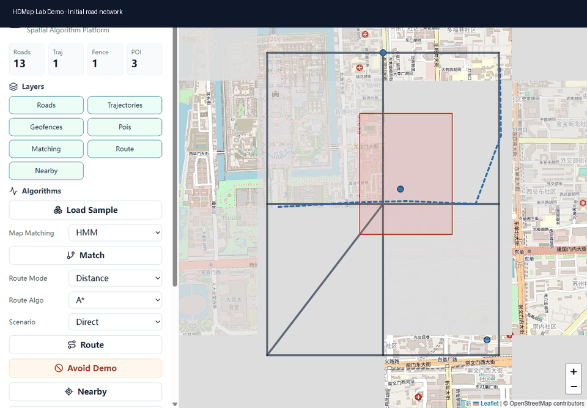

# HDMap-Lab

Computational Geometry Workbench for Dirty Road Networks, Map Matching, Spatial Index Benchmarking and Explainable Routing.

HDMap-Lab is a computational-geometry based map algorithm workbench for dirty road-network repair, spatial index benchmarking, HMM map matching, trajectory analysis, and explainable routing.

中文主线：HDMap-Lab 是一个面向地图算法的计算几何实验平台，用来展示脏路网修复、空间索引加速、HMM 地图匹配、轨迹分析和可解释路径规划能力。



## Why This Project

I built HDMap-Lab to turn ACM-style computational geometry skills into inspectable map-algorithm engineering: robust predicates, degenerate geometry cases, dirty road topology repair, noisy GPS matching, spatial query acceleration, and route explanations exposed through FastAPI and React + Leaflet.

The project is intentionally scoped as an algorithm workbench and case-study platform. It is not a production HD map system, commercial GIS service, or complete OpenDRIVE/Lanelet2 parser.

## Core Highlights

1. **Robust Geometry Kernel**: orientation, segment intersection, point-in-polygon with holes, projection, polyline/polygon utilities, simplification, and degenerate-case tests.
2. **Dirty Road-Network Repair**: duplicate edge detection, illegal crossing split, close-node snapping, dangling edge handling, overlap detection, before/after reports, and debug GeoJSON layers.
3. **Spatial Index Benchmark Suite**: brute force, grid, quadtree, KD-tree, R-tree, STR R-tree, and Morton index under one interface with brute-force correctness checks.
4. **HMM Map Matching Evaluation**: nearest vs HMM matching on synthetic stress cases such as parallel-road drift, sparse sampling, noisy GPS, and one-way penalties.
5. **Explainable Routing + React/Leaflet Visualization**: A*/Dijkstra routing, avoid polygons, turn cost, road-class preference, result metrics, warnings, benchmark tables, and map debug layers.

## Architecture

```text
GeoJSON / OSM
 -> Geometry Kernel
 -> Topology Repair
 -> Spatial Index
 -> Map Matching
 -> Routing / Trajectory
 -> FastAPI
 -> React + Leaflet
```

Main modules:

```text
app/
  geometry_kernel/   robust predicates, intersections, polygon/polyline algorithms
  topology/          validation, snapping, repair, graph compatibility checks
  spatial_index/     brute, grid, quadtree, KD-tree, R-tree, STR R-tree, Morton
  map_matching/      candidate search, cost model, nearest matching, HMM/Viterbi
  trajectory/        Frechet, Hausdorff, DTW, simplification, outlier/deviation analysis
  routing/           Dijkstra, A*, avoid polygons, turn cost, explanations
  hdmap/             lane-level model plus OpenDRIVE/Lanelet2 prototype exchange
```

## Demo Scenarios

### 1. Dirty Road Repair

- Input: dirty toy road network with duplicate edges, close endpoints, illegal crossings, dangling edges, and overlaps.
- Output: repaired road GeoJSON, before/after topology summary, operation log, split points, and debug layers.
- Shows: computational geometry predicates applied to road-network validation and repair.

### 2. Spatial Index Benchmark

- Input: synthetic or local GeoJSON road items plus bbox/radius/nearest queries.
- Output: build time, p50/p95/p99 latency, candidate count, recall, false-positive rate, and JSON/Markdown reports.
- Shows: index engineering and correctness checking against brute force.

### 3. HMM Map Matching Stress Test

- Input: synthetic GPS traces with parallel-road drift, sparse samples, outliers, and one-way edge cases.
- Output: nearest vs HMM metrics, matched sequence, confidence, candidate layers, and debug GeoJSON.
- Shows: why global sequence optimization beats purely nearest-road matching in noisy road networks.

## Quick Start

Backend:

```bash
python -m pip install -r requirements.txt
python -m uvicorn app.main:app --reload
```

Frontend:

```bash
cd frontend
npm install
npm run dev
```

Open:

- API docs: <http://localhost:8000/docs>
- Frontend: <http://localhost:5173>

Docker:

```bash
docker compose config
docker compose up --build
```

`docker compose up --build` requires a running Docker Desktop / Docker Engine. The local release checklist records the latest environment-specific verification result.

## Tests

```bash
python -m ruff check app tests benchmarks scripts
python -m pytest
cd frontend
npm run build
```

Current test coverage includes geometry degeneracies, topology repair cases, spatial index consistency, map matching stress cases, trajectory analysis, routing, and API smoke flows.

## Benchmark

The runnable local benchmarks are:

```bash
python -m benchmarks.spatial_index_benchmark
python -m benchmarks.map_matching_benchmark
python -m benchmarks.topology_repair_benchmark
```

The city-scale script is a local-data benchmark generator, not a committed city-scale claim:

```bash
python -m benchmarks.city_scale_benchmark --roads data/roads.geojson --queries 20
```

For real city-scale results, prepare a local OSM/GeoJSON road extract and keep the generated JSON/Markdown report with the dataset description. Do not compare numbers across machines without recording data size, query count, and hardware.

## Project Status

Completed:

- Geometry kernel and degenerate-case tests.
- Topology validation and repair v1.
- Multi-index spatial query benchmark with brute-force correctness checks.
- Nearest, candidate-cost, and HMM map matching.
- Trajectory analysis and explainable routing APIs.
- React + Leaflet workbench for map layers, metrics, debug layers, and benchmark output.

Prototype:

- Lane-level HD map data model.
- OpenDRIVE/Lanelet2 import/export prototypes.
- PostGIS comparison environment and benchmark script.
- City-scale benchmark generator for local road extracts.

Planned:

- Broader OpenDRIVE/Lanelet2 spec coverage.
- More real-world map extracts and reproducible benchmark profiles.
- More visual before/after screenshots for topology repair and matching stress cases.

## Resume Bullet

English: Built HDMap-Lab, a computational-geometry based map algorithm workbench with robust geometry predicates, dirty road-network repair, brute-force-checked spatial index benchmarks, HMM map matching evaluation, explainable routing, FastAPI experiment APIs, and React + Leaflet visualization.

中文：构建 HDMap-Lab 地图算法实验平台，将 ACM 计算几何能力工程化到脏路网修复、空间索引 benchmark、HMM 地图匹配、轨迹分析和可解释路径规划，并通过 FastAPI 与 React/Leaflet 可视化展示算法结果。

## Limitations

- This is not a production HD map system or commercial GIS platform.
- OpenDRIVE/Lanelet2 support is prototype-level and should not be described as full spec support.
- Default data is toy/synthetic/sample data; city-scale claims require local OSM/GeoJSON extracts and generated reports.
- Benchmark numbers depend on data size, query distribution, Python runtime, and local hardware.
- Geometry functions assume small-area lon/lat road-network use cases; projection and distance approximations are documented for this scope.
